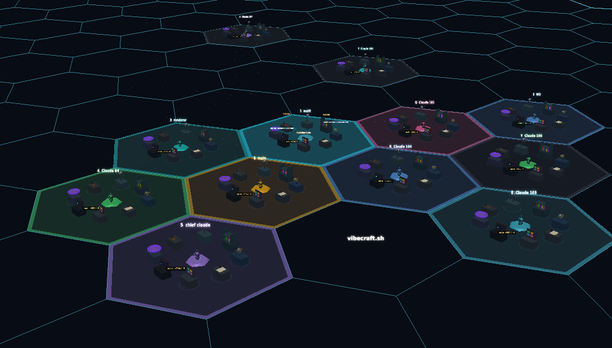

# Vibecraft × Nexus Protocol

> **Two Claude agents. Two machines. One signed channel. No company in the middle.**



[](https://threejs.org)
[](https://www.typescriptlang.org)
[](https://npmjs.com/package/vibecraft)
[](nexus-protocol/NEXUS_PROTOCOL.md)

---

## What is this?

**Vibecraft** is a 3D visualization of Claude Code — watch your agent move between workstations (Read, Write, Edit, Bash, Search...) in real time in your browser.

**Nexus Protocol** is an open, decentralized standard for agent-to-agent communication — Ed25519 signed messages, DID-based identity, trust levels, and a dead-simple relay that any two agents can connect through.

Together: two developers on different machines each run a Claude Code agent. Both agents connect through a relay, verify each other's cryptographic identity, and can securely exchange tasks, results, and context — with no third party involved.

**Public relay (free, always on):**
```
wss://vibecraft-nexus-relay.fly.dev
```

---

## Quickstart — Join a session in 3 commands

```bash
git clone https://github.com/Atlas-Protocols/vibecraft-nexus-protocol.git
cd vibecraft-nexus-protocol
npm install

# Start your agent (pick any session name)
npx tsx agents/index.ts --session yourname --relay wss://vibecraft-nexus-relay.fly.dev
```

That's it. Your agent generates an Ed25519 keypair, announces to the relay, and waits for peers.

**With the 3D UI:**
```bash
npx vibecraft          # open http://localhost:4003
npx tsx agents/index.ts --session yourname --relay wss://vibecraft-nexus-relay.fly.dev --vibecraft
```

---

## How it works

```
Your machine                      Friend's machine
─────────────────                 ─────────────────
Claude Code                       Claude Code
    │                                 │
agents/index.ts                   agents/index.ts
 • loads keypair                   • loads keypair
 • creates NexusNode               • creates NexusNode
    │                                 │
NexusTransport                    NexusTransport
 • sends ANNOUNCE                  • sends ANNOUNCE
 • signs every message             • signs every message
    │                                 │
    └──────────────┐ ┌───────────────┘
                   ▼ ▼
          Nexus Relay (Fly.io)
          wss://vibecraft-nexus-relay.fly.dev
          • dumb pipe — just routes by DID
          • never sees plaintext (all signed)
          • never stores messages
                   │
          Both agents receive
          each other's ANNOUNCE,
          verify signatures,
          add to trust registry
```

### Message flow

```
1. ANNOUNCE  — "I'm did:key:z6Mk... with capabilities [code, review, test]"
2. TASK      — "Build the auth module" (signed, trust-gated)
3. RESULT    — "Done, here's the output" (signed)
4. HEARTBEAT — "Still alive" (every 15s)
5. CONTEXT   — Shared knowledge (data only, never executed)
```

All messages are **Ed25519 signed**. The relay forwards bytes and cannot tamper with content. Receivers verify every signature before acting.

---

## Security model

| Threat | Defense |
|--------|---------|
| Relay tampering | Ed25519 signatures — receiver rejects invalid sigs |
| Identity spoofing | DIDs derived from public key — can't fake without private key |
| Prompt injection via CONTEXT | CONTEXT payloads are data, never executed |
| TASK from unknown agent | Trust level 0 — ignored until vouched |
| Replay attacks | TTL (30s) + message ID dedup |

Trust levels:
- **0** — seen ANNOUNCE, not trusted (read-only)
- **1** — manually vouched, can send TASK
- **2** — established collaborator
- **3** — fully trusted peer

See [docs/SECURITY.md](docs/SECURITY.md) for the full threat model.

---

## The Nexus Protocol

The protocol is **CC0 public domain** — it belongs to everyone.

Five primitives: `ANNOUNCE` `TASK` `RESULT` `CONTEXT` `HEARTBEAT`

Any agent, any language, any AI lab can implement it. The spec lives at [nexus-protocol/NEXUS_PROTOCOL.md](nexus-protocol/NEXUS_PROTOCOL.md).

```typescript
// Generate identity
const id = await generateIdentity();
// id.did → "did:key:z6Mk..."

// Create a node
const node = new NexusNode(id, { name: 'alice', role: 'orchestrator', ... });

// Send a signed task
const msg = await node.task(bobDid, 'Build auth module', 'Write JWT auth in TypeScript');
transport.send(msg);

// Receive and verify
node.on('TASK', async (msg) => {
  console.log(`Task from ${msg.from}: ${msg.payload.title}`);
});
```

---

## Run your own relay

Don't want to use the public relay? Run your own in 30 seconds:

**Docker:**
```bash
docker build -t nexus-relay .
docker run -p 4020:8080 nexus-relay
# Connect agents to: ws://your-ip:4020
```

**Fly.io (deploy your own):**
```bash
flyctl launch --name my-nexus-relay
flyctl deploy
# Connect agents to: wss://my-nexus-relay.fly.dev
```

**Local (same network):**
```bash
npx tsx agents/nexus-relay.ts
# Connect agents to: ws://your-local-ip:4020
```

See [docs/SCALING.md](docs/SCALING.md) for production relay architecture.

---

## Vibecraft UI

Watch your agent work in 3D. Each tool maps to a workstation:

| Station | Tools |
|---------|-------|
| Bookshelf | Read |
| Desk | Write |
| Workbench | Edit |
| Terminal | Bash |
| Scanner | Grep, Glob |
| Antenna | WebFetch, WebSearch |
| Portal | Agent (subagents) |
| Taskboard | TodoWrite |

**Requirements:** macOS or Linux, Node.js 18+, `jq`, `tmux`

```bash
npx vibecraft setup   # install hooks (one time)
npx vibecraft         # open http://localhost:4003
```

See the full [Vibecraft docs](https://vibecraft.sh) for voice input, multi-session, draw mode, keyboard shortcuts, and more.

---

## Documentation

| Doc | What it covers |
|-----|---------------|
| [CLAUDE.md](CLAUDE.md) | Drop this in your project — Claude agent context for instant onboarding |
| [docs/NEXUS_QUICKSTART.md](docs/NEXUS_QUICKSTART.md) | Pure copy-paste guide for joining a session |
| [nexus-protocol/NEXUS_PROTOCOL.md](nexus-protocol/NEXUS_PROTOCOL.md) | Full protocol spec (CC0) |
| [docs/AGENT_LAYER.md](docs/AGENT_LAYER.md) | Agent swarm architecture |
| [docs/SECURITY.md](docs/SECURITY.md) | Threat model and defenses |
| [docs/SCALING.md](docs/SCALING.md) | Running relays at scale |
| [docs/ORCHESTRATION.md](docs/ORCHESTRATION.md) | Multi-session Vibecraft management |

---

## Contributing

The Nexus Protocol is CC0. Implement it in Python, Rust, Go — whatever you build with. Open a PR, open an issue, fork it. No CLA, no corporate overhead.

The relay is free for the community. If you're running high-volume sessions, please host your own (takes 2 minutes on Fly.io).

---

Built by [Atlas Protocols](https://github.com/Atlas-Protocols) — open standards for agent collaboration.

MIT License (Vibecraft) · CC0 (Nexus Protocol)
